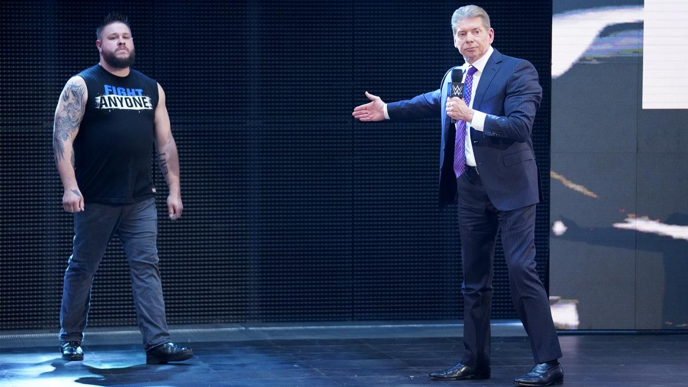

# SmackDown LIVE 1019期

> 日期：2019.02.26
>
> 地点：夏洛特，光谱中心

### 本期看点

- 在WWE冠军赛签订仪式上，主席 Mr. McMahon 现身宣布由 Kevin Owens 代替 Kofi Kingston 参赛；
- The Hardy Boyz 重组迎战 The Bar
- 美国冠军 R-Truth 接受 Andrade 与 Rey Mysterio 的挑战；
- Charlotte Flair 登台喊话 Ronda Rousey 和 Becky Lynch
- NXT双星 Aleister Black & Ricochet 迎战 Shinsuke Nakamura & Rusev；
- Kevin Owens 搭档 Kofi Kingston 迎战 Daniel Bryan & Rowan。

### 本期赛果

- The Hardy Boyz 击败 The Bar
- R-Truth 击败 Andrade & Rey Mysterio 卫冕美国冠军
- Aleister Black & Ricochet 击败 Shinsuke Nakamura & Rusev
- Kevin Owens & Kofi Kingston 击败 Daniel Bryan & Rowan