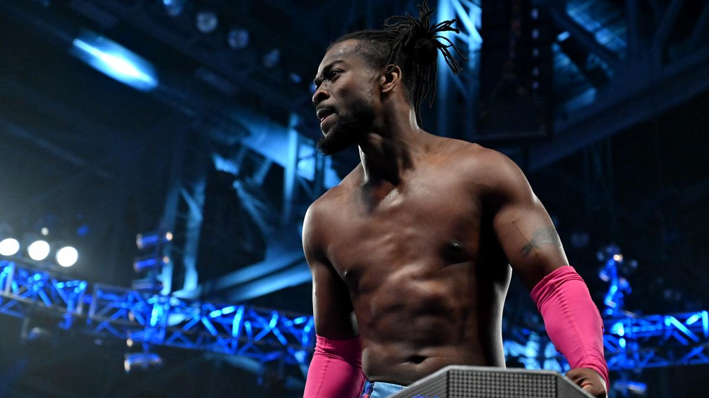

# SmackDown LIVE 1021期 

> 日期：2019.03.12
>
> 地点：代顿，诺特中心

### 本期看点

- Shane McMahon 解释为何在 Fastlane 上攻击 The Miz；
- The New Day 干扰八人组队赛的进行；
- Randy Orton 与 AJ Styles 约战 WrestleMania；
- Charlotte Flair 与 Becky Lynch 继续言语冲突；
- Mr. McMahon 给 Kofi Kingston 一个巨大的且无比艰难的机会。

### 本期赛果

- The Hardy Boyz & Aleister Black & Ricochet 对阵 The Bar & Shinsuke Nakamura & Rusev 因 The New Day 的干扰无结果
- Asuka 战胜 Sonya Deville
- Rey Mysterio & R-Truth 战胜 Samoa Joe & Andrade
- Daniel Bryan & Rowan 战胜 Kevin Owens & Mustafa Ali
